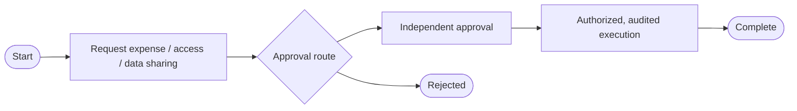

# BPMN business-process assessment (0.6.0)

The System One harness now imports a bounded BPMN 2.0 model into a Mithril ontology, computes conservative structural control facts, and runs the pinned Mithril OWL/SHACL evaluator. No LLM calls, business transactions, scripts or external references execute. This is model assessment, not operational certification.

The three reference processes are **expense/payment approval**, **access request/grant**, and **customer-data external sharing**. Each has a vulnerable and repaired `.bpmn` file in [examples/business-process](../examples/business-process). They are importable non-executable XML models; their node names supply the business vocabulary. They include BPMN DI shapes and edges for editor import.

| Control | Vulnerable model | Repaired model |
| --- | --- | --- |
| Approval | Gateway can reach execution without approval | Alternative branch terminates as rejected |
| Separation of duties | Same declared requester and approver principal | Distinct declared principals |
| Authorization | Execution explicitly declares `false` | Execution declares `true` |
| Audit | Execution explicitly declares `false` | Execution declares `true` |



## Input and coverage

Use the standard BPMN model namespace `http://www.omg.org/spec/BPMN/20100524/MODEL` and explicit Mithril attributes in `https://mithril.fund/business-process/v1`: `operation="request|approve|execute"`, a matching `control` identifier, declared `principal`, and execution booleans `authorized` / `audited`. Omitted booleans/principals are unknown gaps, never presumed failures or successes. Role labels alone do not prove actor separation. At least one declared sensitive execution is required; undeclared task sensitivity cannot be inferred.

The parser accepts one non-executable, acyclic process with start/end events, tasks, and explicit exclusive split/merge gateways (100 nodes, 200 flows, 1 MiB XML). Every node must be reachable and able to terminate. DTD/entities, duplicate IDs, invalid references, implicit splits/joins, executable task annotations, expressions, parallel/inclusive/event gateways, timers, subprocesses, cycles and richer execution semantics refuse. This is a strict assessment profile, not the whole BPMN standard or a token engine. BPMN specification: [OMG BPMN 2.0.2](https://www.omg.org/spec/BPMN/2.0.2/).

All exclusive branches are treated as potentially feasible. A bypass witness is therefore a structural candidate and may be infeasible under an unmodeled real-world condition. Approval must belong to the same control and precede execution on every structural path. Separation compares all modeled matching requesters reaching an approval. Business scope, amounts, consent, time validity, nested entitlements, collusion, fraud and actual IAM/audit evidence are not evaluated by these four rules. A `true` annotation is a caller declaration; it does not establish implementation enforcement.

Normalized nodes and flow edges, source/policy SHA-256, compiler pins, graph digest, facts, findings and exact bypass paths are returned. Independent expected failing focus IDs must match actual Mithril `sh:hasValue` violations; mismatch refuses. A repaired example has `model_status: conforms`, but overall `status: review_incomplete` remains because operational evidence is absent.

## Run

```sh
node --input-type=module -e 'import {readFileSync} from "node:fs"; console.log(JSON.stringify({xml:readFileSync("examples/business-process/payment-vulnerable.bpmn","utf8")}))' | node bin/mithril-business-process.mjs --stdin
npm run test:business-process
npm run check:security-release
```

API: `assessBusinessProcess(xml)` from `lib/business-process.mjs`. MCP and the owning Hermes profile expose `mithril_business_process_review({xml})`. The provider still uses the operator-configured `api.mithril.fund`; deterministic tool dispatch needs no provider call. No installed Desktop BPMN editor, automatic UI integration or operational log connector is claimed.

To assess a real organization, first replace reference declarations with its approved process model and principal/control evidence. Preserve model review and evidence validation as separate results. This release does not automatically modify that organization’s workflow.

## Qualification

[Compiler receipt](../examples/business-process/qualification.json) and [native profile receipt](../examples/business-process/native-qualification.json) bind all six BPMN files by SHA-256. Each vulnerable model produces four violations and each repaired model produces none. Eight integration tests cover the real compiler, CLI/MCP, unknown declarations, cross-control approval, unsupported XML/graph semantics and compiler-result mismatch. Local release checks passed core 75, Todo 3, Python 29, dependency runtime 9, SCAP runtime 5, SCAP importer 9, and BPMN 8 tests. Native owning-profile dispatch verified six cases and absence in an unrelated profile. No GitHub Actions ran. A transient local volume-full error interrupted receipt/native regeneration; both were subsequently rerun successfully against the final files. No installed Desktop GUI or new paid model conversation was tested.
