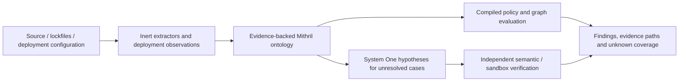

# System One and ontology security evaluation

Status: bounded local proof of concept. Three supplied-snapshot policies execute
through the actual pinned Mithril compiler, OWL reasoner and SHACL validator.
This is not a complete SAST scanner or a claim of production security readiness.

## Intended architecture



Source entities include files, definitions, calls, data-flow sources/sinks,
checks, capabilities and dependency versions. Environment entities include
services, routes, principals, credential bindings, public storage, network
reachability and deployed versions. Edges connect these: an endpoint invokes a
function; input reaches a sink; a Worker binds a bucket; a principal has a
capability. Each observation needs a source span or inventory resource, revision,
digest, extraction method and observation time. Secret values are never graph
properties. Runtime metadata is supplied through read-only owner-scoped adapters,
not arbitrary subprocesses or URLs selected by a model.

Existing Mithril CodeGraph has inert location-aware extraction for its supported
Lisp/Mithril documents. Its call/reference graph is not a complete taint analysis.
Unsupported constructs and unresolved references must remain coverage gaps.
Language-specific data-flow tools can supply additional evidence: for example,
[CodeQL's JavaScript/TypeScript data-flow and taint analysis](https://codeql.github.com/docs/codeql-language-guides/analyzing-data-flow-in-javascript-and-typescript/).
[SHACL](https://www.w3.org/TR/shacl/) validates constraints against the supplied
graph; conformance says nothing about unobserved parts of the application.

## Implemented scope

`examples/security-ontology/policy.mith` defines three fixed policies:

| Rule | Supplied condition | Required state |
| --- | --- | --- |
| AUTH_PUBLIC_SENSITIVE | Public, sensitive endpoint | Verified authorization |
| UNTRUSTED_SHELL | Invocation consumes user-controlled input | Shell disabled |
| PUBLIC_SECRET | Secret binding | Not public |

`lib/security-ontology.mjs` validates a bounded snapshot (up to 1,000 records),
serializes it to RDF, compiles `.mith`, and checks the engine's violations against
an ordinary reference projection. Findings mean a policy violation in supplied
facts, not a demonstrated exploit. Public endpoints may intentionally be open;
only explicitly marked sensitive endpoints enter the first policy. Disabling a
shell does not prove arbitrary command execution is safe. Secret existence is
metadata; raw secret values are rejected by the record schema.

Unknown facts are excluded from asserted graph conditions and returned explicitly.
Empty inventories, incomplete extraction or unresolved references cannot produce
a whole-assessment conformance result. The example's configuration is fictional;
its evidence path/digest points to the checked-in fixture. The evaluator records
all supplied evidence locations/digests but does not authenticate them against a
repository or a live deployment. Source/environment extractors remain to be built.

```sh
npm run setup:dynamic
node bin/mithril-security.mjs --stdin < examples/security-ontology/snapshot.json
npm run test:security
```

CLI exit codes: 0 for conformance in the supplied scope; 2 for policy violations
or incomplete facts; 1 for rejected input/runtime. It performs no network scan,
source execution, remediation or deployment.

The library also has a `method: 'system-one'` policy-code lane using the existing
`api.mithril.fund` adapter. In this proof it proposes only a compact `.mith`
policy, not new vulnerability claims or source facts. Private snapshots/evidence
are absent from its prompt. The real compiler must preserve the baseline RDF
graph digest and independent evaluation result; weakened policies are refused.
Unknown provider outcomes stop without retry. The lane has mocked-provider and
real-compiler tests; live-provider security qualification has not been run.
It is not yet a security tool in the published Registry/MCP/Hermes task catalog.

## Performance and evaluation plan

The integration test evaluates 100 alternating three-record snapshots using one
compiled ontology. Every bad snapshot must retain exactly three violations;
every repaired snapshot must have none. It measures compilation separately from
per-snapshot parse/OWL/SHACL evaluation. This is a small synthetic engine test,
not a repository-scale latency, exploit-detection or LLM comparison benchmark.
The current CLI starts a fresh compiler process for each invocation.

A production fast path should keep reviewed compiled artifacts resident, cache
facts by content digest and environment revision, and recompute affected rule
closures after changes. Retractions must remove old inferred facts. Differential
checks against full reevaluation are mandatory before claiming incremental
correctness. Measure cold extraction, warm full evaluation, delta evaluation,
and any inference/verification separately.

Next acceptance gates:

1. Supported Mithril source extractor with exact spans/digests and explicit
   unsupported constructs; import validated environment and dependency snapshots.
2. Labelled positive, negative, sanitized and ambiguous examples for authorization,
   tenant isolation, injection, path traversal, SSRF and capabilities.
3. Source-to-sink and configuration-to-runtime evidence paths, with runtime
   observations independently checked and expiry/coverage visible.
4. Read-only sandbox verification for selected findings; compare precision,
   recall and unknown rate against ordinary tools on the identical task set.
5. Benchmark identical repository snapshots with extraction included. Publish
   latency p50/p95, memory, inference calls and actual billed cost. No speed or
   cost multiplier relative to LLM agents is established by this prototype.
6. Register the qualified evaluator through the existing shared MCP/Agent/
   Workflow/Plugin surfaces and Desktop components. Run verification locally or
   over the standalone Tailscale CI, rather than requiring Actions qualification.

Observed local sample (2026-10-08): 100 alternating three-record snapshots, policy
compilation 100.73 ms, mean graph evaluation 33.35 ms. One run, not a p95 or a
comparison against an LLM. Extraction/inference/live observations/exploit
verification are excluded. [Machine, source hashes and runtime pins](../bench/results/security-ontology-20261008/synthetic.json)
are recorded with the result.
